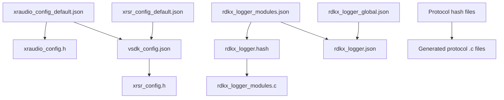

# XR Voice SDK - Component Boundaries and Interdependencies Analysis

## Component Architecture Overview

Based on CMakeLists.txt analysis, the XR Voice SDK is structured as 9 distinct components with clear boundaries and well-defined interdependencies. The build system creates a single shared library (`xr-voice-sdk`) that integrates all components.

## Primary Components and Boundaries

### 1. Core Integration Layer
**Location:** `src/`
**Key Files:**
- `vsdk.c` - Master integration and initialization
- `vsdk_private.h` - Internal API definitions  
- `xr_voice_sdk.h` - Public API surface

**Responsibilities:**
- SDK lifecycle management (init/term)
- Plugin system integration
- Version management
- Public API implementation

### 2. Audio Processing Component (xr-audio/)
**Boundary Definition:**
```cmake
./xr-audio/
./xr-audio/adpcm/
./xr-audio/opus/
```

**Component Files:**
- `xraudio.c` - Core audio management
- `xraudio_input.c` / `xraudio_output.c` - I/O handling
- `xraudio_thread.c` - Threading implementation
- `xraudio_utils.c` - Utility functions
- `xraudio_atomic.c` - Atomic operations
- `adpcm/adpcm_decode.c` - ADPCM codec
- `opus/xraudio_opus.c` - Opus codec (optional)

**Configuration Dependencies:**
- `xraudio_config_default.json` → `xraudio_config.h`
- Runtime configuration through JSON parsing

### 3. Speech Router Component (xr-speech-router/)
**Boundary Definition:**
```cmake
./xr-speech-router/
```

**Core Files:**
- `xrsr.c` - Main speech routing logic
- `xrsr_msgq.c` - Message queue integration
- `xrsr_xraudio.c` - Audio integration
- `xrsr_utils.c` - Utility functions

**Protocol-Specific Files (Conditional):**
- `xrsr_protocol_http.c` - HTTP protocol (if HTTP_ENABLED)
- `xrsr_protocol_ws.c` - WebSocket protocol (if WS_ENABLED)  
- `xrsr_protocol_sdt.c` - SDT protocol (if SDT_ENABLED)

**Configuration Dependencies:**
- `xrsr_config_default.json` → `xrsr_config.h`
- Combined into `vsdk_config.json` with audio config

### 4. Voice Recognition Component (xr-speech-vrex/)
**Boundary Definition:**
```cmake
./xr-speech-vrex/
./xr-speech-vrex/xrsv_http/
./xr-speech-vrex/xrsv_ws_nextgen/
```

**Component Files:**
- `xrsv_utils.c` - Common utilities
- `xrsv_http/xrsv_http.c` - HTTP-based recognition
- `xrsv_ws_nextgen/xrsv_ws_nextgen.c` - WebSocket next-gen recognition

**Generated Protocol Files:**
- `xrsv_ws_nextgen_msgtype.c` - Generated from hash tables
- `xrsv_ws_nextgen_tv_control.c` - Generated control interfaces

### 5. Logging Framework Component (xr-logger/)
**Boundary Definition:**
```cmake
./xr-logger/
./xr-logger/rdkv/
```

**Component Files:**
- `xr-logger/rdkx_logger.c` - Core logging implementation
- `rdkx_logger_modules.c` - Generated module lookup
- `rdkx_logger_level.c` - Generated log level management
- `rdkx_logger_modules_lookup.c` - Generated lookup tables

**Configuration Processing:**
- `rdkv/rdkx_logger_modules.json` - Module definitions
- `rdkv/rdkx_logger_global.json` - Global logging config
- Combined processing: `rdkx_logger_modules.json` → `rdkx_logger.json`

### 6. Message Queue Component (xr-mq/)
**Boundary Definition:**
```cmake
./xr-mq/
```

**Component Files:**
- `xr_mq.c` - Message queue implementation

### 7. State Management Component (xr-sm-engine/)
**Boundary Definition:**
```cmake
./xr-sm-engine/
```

**Component Files:**
- `xr_sm_engine.c` - State machine engine implementation

### 8. Timer Services Component (xr-timer/)
**Boundary Definition:**
```cmake
./xr-timer/
```

**Component Files:**
- `xr_timer.c` - Timer service implementation

### 9. Timestamp Services Component (xr-timestamp/)
**Boundary Definition:**
```cmake
./xr-timestamp/
```

**Component Files:**
- `xr_timestamp.c` - Timestamp service implementation

### 10. Fault Detection Component (xr-fdc/)
**Boundary Definition:**
```cmake
./xr-fdc/
```

**Component Files:**
- `xr_fdc.c` - Fault detection and correction

## Component Interdependencies

### Include Directory Dependencies

The CMakeLists.txt defines the include path hierarchy showing component relationships:

```cmake
target_include_directories(xr-voice-sdk PUBLIC 
    ./                                    # Core SDK headers
    ./xr-mq/                             # Message queue interfaces
    ./xr-fdc/                            # Fault detection interfaces  
    ./xr-timestamp/                      # Timestamp service interfaces
    ./xr-timer/                          # Timer service interfaces
    ./xr-audio/                          # Audio processing interfaces
    ./xr-sm-engine/                      # State management interfaces
    ./xr-speech-router/                  # Speech routing interfaces
    ./xr-speech-vrex/                    # Voice recognition interfaces
    ./xr-speech-vrex/xrsv_http/          # HTTP recognition interfaces
    ./xr-speech-vrex/xrsv_ws_nextgen/    # WebSocket recognition interfaces
    ./xr-logger/                         # Logging framework interfaces
)
```

### Build-Time Dependencies

**Configuration Generation Pipeline:**


### External Library Dependencies

**Required Libraries:**
- `c` - Standard C library
- `bsd` - BSD compatibility functions
- `m` - Math library
- `pthread` - POSIX threading
- `anl` - Asynchronous name lookup
- `uuid` - UUID generation
- `jansson` - JSON parsing

**Optional Libraries (Feature-Dependent):**
- `curl` - HTTP protocol support (if HTTP_ENABLED)
- `nopoll` - WebSocket protocol support (if WS_ENABLED)  
- `opus` - Opus codec support (if available)
- `curtail` - Curtail functionality (if available)
- `rdkversion` - RDK versioning (if RDK_VERSION_ENABLED)

### Protocol-Specific Dependencies

**HTTP Protocol (Optional):**
```cmake
if(HTTP_ENABLED)
   target_sources(xr-voice-sdk PUBLIC xr-speech-router/xrsr_protocol_http.c)
   target_link_libraries(xr-voice-sdk curl)
endif()
```

**WebSocket Protocol (Optional):**
```cmake
if(WS_ENABLED)
   target_sources(xr-voice-sdk PUBLIC xr-speech-router/xrsr_protocol_ws.c)
   target_link_libraries(xr-voice-sdk nopoll)
endif()
```

**SDT Protocol (Optional):**
```cmake
if(SDT_ENABLED)
   target_sources(xr-voice-sdk PUBLIC xr-speech-router/xrsr_protocol_sdt.c)
endif()
```

## Component Interaction Patterns

### 1. Core Integration Flow
```
vsdk.c (Core) 
  ├── Initializes all components
  ├── Manages plugin loading
  ├── Coordinates shutdown
  └── Provides public API surface
```

### 2. Audio Processing Integration
```
xr-audio Component
  ├── Provides audio I/O services to xr-speech-router
  ├── Uses xr-timer for scheduling
  ├── Uses xr-timestamp for synchronization  
  ├── Integrates with xr-logger for diagnostics
  └── Connects to hardware via plugin system
```

### 3. Speech Processing Chain
```
xr-speech-router
  ├── Receives audio data from xr-audio
  ├── Uses xr-mq for message passing
  ├── Connects to xr-speech-vrex for recognition
  ├── Uses xr-sm-engine for state management
  └── Integrates with protocol-specific modules
```

### 4. Cross-Component Services
```
xr-logger (Logging)
  └── Used by ALL components for diagnostics

xr-mq (Message Queue)  
  └── Used by speech-router and speech-vrex

xr-sm-engine (State Management)
  └── Coordinates component states

xr-timer (Timer Services)
  └── Used by audio and networking components

xr-timestamp (Time Services)
  └── Used for synchronization across components

xr-fdc (Fault Detection)
  └── Monitors all component health
```

## Build System Integration

### Shared Library Target
```cmake
add_library(xr-voice-sdk SHARED)
set_target_properties(xr-voice-sdk PROPERTIES
    SOVERSION ${CMAKE_PROJECT_VERSION_MAJOR}
    VERSION   ${CMAKE_PROJECT_VERSION}
)
```

### Compilation Options
```cmake
target_compile_options(xr-voice-sdk PUBLIC -fPIC -rdynamic -Wall -Werror)
target_compile_definitions(xr-voice-sdk PUBLIC _REENTRANT _POSIX_C_SOURCE=200809L _GNU_SOURCE)
```

### Installation Structure
**Headers Installed:**
- `xr_voice_sdk.h` - Main public API
- `xrsr.h` - Speech router public API  
- `xrsv.h` - Voice recognition public API
- `xrsv_http.h` - HTTP recognition API
- `xrsv_ws_nextgen.h` - WebSocket recognition API

**Configuration Files:**
- `vsdk_config.json` - Combined runtime configuration
- `rdkx_logger.json` - Logging system configuration

**Library:**
- `libxr-voice-sdk.so` - Main shared library

## Configuration Management Architecture

### JSON Configuration Processing
The build system implements sophisticated configuration processing:

1. **Source Configurations:**
   - Individual component default configurations
   - Module-specific logging configurations  
   - Protocol-specific configuration files

2. **Processing Scripts:**
   - `vsdk_json_combine.py` - Combines multiple JSON sources
   - `vsdk_json_to_header.py` - Generates C headers from JSON
   - `rdkx_logger_modules_to_c.py` - Generates logging module code

3. **Generated Artifacts:**
   - Runtime configuration files (JSON)
   - Compile-time configuration headers (.h)
   - Generated lookup code (.c)

### Build-Time Code Generation

**Hash Table Generation:**
- Uses `gperf` for perfect hash function generation
- Generates efficient lookup tables for:
  - Logging module names
  - Protocol message types  
  - Control interface mappings

## Component Isolation and Modularity

### Physical Separation
- Each component has its own source directory
- Clear include path boundaries
- Separate configuration management

### Logical Separation  
- Component-specific header files
- Defined public interfaces
- Internal implementation hiding

### Optional Component Loading
- Protocol modules can be disabled at build time
- Codec support is detected and conditionally compiled
- Plugin system allows runtime component extension

## Cross-Platform Considerations

### Platform Abstractions
- Threading abstraction (POSIX)
- Audio device abstraction (HAL plugins)
- Network interface handling
- File system operations

### Conditional Compilation
```cmake
# Feature detection and conditional compilation
find_library(OPUS_LIBRARY NAMES opus)
if(OPUS_LIBRARY)
   target_compile_definitions(xr-voice-sdk PUBLIC XRAUDIO_DECODE_OPUS)
endif()
```

## Summary

The XR Voice SDK demonstrates excellent component architecture with:

- **Clear Boundaries**: Each component has well-defined source boundaries and responsibilities
- **Managed Dependencies**: Systematic include paths and linking dependencies  
- **Flexible Integration**: Optional protocol and codec support
- **Configuration Management**: Sophisticated build-time configuration processing
- **Cross-Component Services**: Shared utilities (logging, messaging, timing) used across components
- **Plugin Architecture**: Runtime extensibility without component boundary violations  

This architecture enables maintainable, testable, and extensible voice processing capabilities while maintaining performance and reliability requirements.