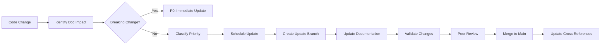

# XR Voice SDK Documentation Maintenance Guidelines

## Overview

This document establishes comprehensive guidelines for maintaining and updating the XR Voice SDK documentation to ensure it remains accurate, complete, and synchronized with the evolving codebase. These guidelines provide processes, procedures, and best practices for ongoing documentation maintenance.

## Documentation Maintenance Philosophy

### Core Principles

1. **Documentation-as-Code:** Treat documentation with the same rigor as source code
2. **Continuous Synchronization:** Keep documentation aligned with code changes in real-time
3. **Validation-Driven Updates:** All documentation changes require validation against implementation
4. **Quality Gates:** Establish checkpoints to prevent documentation drift
5. **Automated Where Possible:** Leverage automation to reduce manual maintenance burden

### Maintenance Objectives

- **Accuracy:** 100% alignment between documentation and implementation
- **Completeness:** Full coverage of all public APIs and configuration options
- **Timeliness:** Documentation updates within 24 hours of code changes
- **Accessibility:** Clear navigation and cross-referencing for efficient information discovery
- **Quality:** Consistent formatting, style, and technical depth

## Documentation Change Management Process

### 1. Change Identification and Classification

#### Trigger Events for Documentation Updates

**Code Changes Requiring Documentation Updates:**
```yaml
mandatory_update_triggers:
  - public_api_changes: "Function signatures, new APIs, deprecated APIs"
  - configuration_schema_changes: "JSON schema modifications, new parameters"
  - build_system_changes: "CMake options, dependencies, build procedures"
  - architecture_changes: "Component relationships, threading model changes"
  - security_changes: "Authentication, encryption, security model updates"

optional_update_triggers:
  - internal_refactoring: "May require architecture documentation review"
  - performance_improvements: "May require performance analysis updates"
  - bug_fixes: "May require error handling documentation updates"
```

#### Change Classification System

**Priority Levels:**
- **P0 (Critical):** API breaking changes, security updates
- **P1 (High):** New APIs, configuration changes, architecture modifications  
- **P2 (Medium):** Performance improvements, feature enhancements
- **P3 (Low):** Internal refactoring, bug fixes, code cleanup

### 2. Documentation Update Workflow

#### Standard Update Process



#### Documentation Update Checklist

**Pre-Update Verification:**
- [ ] Identify all affected documentation files
- [ ] Review current documentation for accuracy
- [ ] Determine scope of changes required
- [ ] Check for cross-reference impacts

**Update Execution:**
- [ ] Create feature branch for documentation changes
- [ ] Update primary documentation files
- [ ] Update cross-reference systems
- [ ] Update architectural diagrams if needed
- [ ] Validate against source code implementation

**Post-Update Validation:**
- [ ] Run documentation validation scripts
- [ ] Verify all cross-references are valid
- [ ] Check formatting and style consistency
- [ ] Validate example code compiles and runs
- [ ] Update modification timestamps

### 3. Automated Validation Framework

#### Documentation Validation Pipeline

**Validation Stages:**
```yaml
validation_pipeline:
  stage_1_syntax:
    - markdown_validation: "Check Markdown syntax and formatting"
    - link_validation: "Verify all internal and external links"
    - image_validation: "Check diagram references and accessibility"
    
  stage_2_content:
    - api_cross_reference: "Validate API documentation against headers"
    - config_schema_check: "Verify configuration examples against JSON schema"
    - code_example_compilation: "Compile and test all code examples"
    
  stage_3_consistency:
    - cross_reference_validation: "Check all document cross-references"
    - terminology_consistency: "Verify consistent term usage"
    - style_guide_compliance: "Check adherence to documentation standards"
```

#### Continuous Integration Integration

**CI/CD Pipeline Integration:**
```yaml
# .github/workflows/documentation-validation.yml
name: Documentation Validation
on:
  pull_request:
    paths:
      - 'docs/**'
      - 'src/**/*.h'
      - 'src/**/*.json'
      
jobs:
  validate-documentation:
    runs-on: ubuntu-latest
    steps:
      - name: Checkout code
        uses: actions/checkout@v3
        
      - name: Validate Markdown
        run: markdownlint docs/**/*.md
        
      - name: Check links
        run: markdown-link-check docs/**/*.md
        
      - name: Validate API cross-references
        run: python scripts/validate_api_docs.py
        
      - name: Check configuration schemas
        run: python scripts/validate_config_schemas.py
        
      - name: Compile code examples
        run: scripts/test_code_examples.sh
```

## Component-Specific Maintenance Procedures

### 1. Core SDK API Documentation Maintenance

#### Monitored Files and Triggers

**Source Files to Monitor:**
- `src/xr_voice_sdk.h` - Core API definitions
- `src/vsdk_private.h` - Internal interfaces that affect public behavior
- `CMakeLists.txt` - Build configuration changes

**Maintenance Procedures:**
```bash
#!/bin/bash
# api_doc_maintenance.sh - Core API documentation maintenance script

# 1. Extract API changes
git diff HEAD~1 HEAD -- src/xr_voice_sdk.h > api_changes.diff

# 2. Identify function signature changes  
python scripts/analyze_api_changes.py api_changes.diff

# 3. Update API documentation
if [[ -n $(python scripts/detect_api_changes.py) ]]; then
    echo "API changes detected, updating documentation..."
    python scripts/update_api_docs.py
    
    # 4. Validate updated documentation
    python scripts/validate_api_docs.py src/xr_voice_sdk.h docs/API_Interface_Documentation.md
fi
```

**Update Templates:**
```markdown
# API Change Documentation Template

## Changed Function: `function_name`

**Change Type:** [Added|Modified|Deprecated|Removed]
**Date:** YYYY-MM-DD
**Version:** X.Y.Z

### Previous Signature:
```c
old_function_signature();
```

### New Signature:
```c  
new_function_signature();
```

### Migration Guide:
[Description of how to migrate from old to new API]

### Rationale:
[Explanation of why the change was made]
```

### 2. Component Architecture Documentation Maintenance

#### XRAudio Component Maintenance

**Monitored Locations:**
- `src/xr-audio/` - All audio component files
- `src/xr-audio/xraudio_config_default.json` - Configuration changes

**Maintenance Script:**
```python
#!/usr/bin/env python3
# xraudio_doc_maintenance.py

import json
import os
from pathlib import Path

def update_xraudio_documentation():
    # Monitor configuration schema changes
    config_file = Path("src/xr-audio/xraudio_config_default.json")
    doc_file = Path("docs/XRAudio_Component_Analysis.md")
    
    if config_file.stat().st_mtime > doc_file.stat().st_mtime:
        print("XRAudio configuration updated, refreshing documentation...")
        update_config_documentation(config_file, doc_file)
    
    # Monitor header file changes
    header_files = list(Path("src/xr-audio/").glob("*.h"))
    for header in header_files:
        if header.stat().st_mtime > doc_file.stat().st_mtime:
            print(f"XRAudio header {header} updated, reviewing documentation...")
            validate_header_documentation(header, doc_file)

def update_config_documentation(config_path, doc_path):
    """Update configuration schema documentation"""
    with open(config_path) as f:
        config = json.load(f)
    
    # Generate updated configuration documentation
    config_doc = generate_config_documentation(config)
    
    # Update the relevant section in the documentation file
    update_documentation_section(doc_path, "Configuration Schema", config_doc)

if __name__ == "__main__":
    update_xraudio_documentation()
```

#### XRSR Component Maintenance

**Protocol Implementation Monitoring:**
```bash
#!/bin/bash
# xrsr_protocol_maintenance.sh

# Monitor protocol implementation files
PROTOCOL_FILES=(
    "src/xr-speech-router/xrsr_protocol_http.c"
    "src/xr-speech-router/xrsr_protocol_ws.c" 
    "src/xr-speech-router/xrsr_protocol_sdt.c"
)

for file in "${PROTOCOL_FILES[@]}"; do
    if [[ $file -nt docs/XRSR_Architecture_Protocol_Analysis.md ]]; then
        echo "Protocol implementation updated: $file"
        python scripts/update_protocol_documentation.py "$file"
    fi
done
```

### 3. Configuration Documentation Maintenance

#### JSON Schema Validation and Updates

**Configuration Monitoring Script:**
```python
#!/usr/bin/env python3
# config_maintenance.py

import json
import jsonschema
from pathlib import Path

CONFIG_FILES = {
    "src/xr-audio/xraudio_config_default.json": "docs/Configuration_Schema_Documentation.md",
    "src/xr-speech-router/xrsr_config_default.json": "docs/Configuration_Schema_Documentation.md",
    "src/xr-logger/rdkv/rdkx_logger_global.json": "docs/Configuration_Schema_Documentation.md"
}

def validate_and_update_config_docs():
    for config_file, doc_file in CONFIG_FILES.items():
        config_path = Path(config_file)  
        doc_path = Path(doc_file)
        
        if config_path.exists() and config_path.stat().st_mtime > doc_path.stat().st_mtime:
            print(f"Configuration file updated: {config_file}")
            
            # Validate JSON syntax
            with open(config_path) as f:
                try:
                    config = json.load(f)
                    print(f"✓ Valid JSON: {config_file}")
                except json.JSONDecodeError as e:
                    print(f"✗ Invalid JSON in {config_file}: {e}")
                    continue
            
            # Update documentation
            update_config_documentation(config_path, doc_path)
            
def update_config_documentation(config_path, doc_path):
    """Update configuration documentation with new schema information"""
    
    # Generate schema documentation
    schema_doc = generate_schema_documentation(config_path)
    
    # Update the documentation file
    update_documentation_section(doc_path, f"Configuration: {config_path.name}", schema_doc)
    
    print(f"Updated documentation: {doc_path}")

if __name__ == "__main__":
    validate_and_update_config_docs()
```

## Documentation Quality Assurance

### 1. Style and Formatting Standards

#### Documentation Style Guide

**Markdown Standards:**
- Use ATX-style headers (`#`, `##`, `###`)
- Consistent code block formatting with language specification
- Proper link formatting for cross-references
- Consistent table formatting and alignment
- Standard list formatting (no mixed bullet styles)

**Technical Writing Standards:**
- Clear, concise language appropriate for technical audience
- Consistent terminology throughout documentation
- Active voice where possible
- Present tense for current functionality
- Future tense for planned enhancements

**Code Example Standards:**
```markdown
# Code Example Template

## Code Block Format:
```c
// Brief comment explaining the example
int result = vsdk_init(true, "app.log", 1024 * 1024);
if (result != 0) {
    // Error handling
    return result;
}
```

## Expected Output:
```
SDK initialized successfully
```
```

#### Automated Style Checking

**Style Validation Tools:**
```bash
#!/bin/bash
# style_check.sh - Documentation style validation

# Check Markdown formatting
markdownlint docs/**/*.md --config .markdownlint.json

# Check spelling
cspell "docs/**/*.md"

# Check terminology consistency  
python scripts/check_terminology.py docs/

# Validate code examples
python scripts/validate_code_examples.py docs/

# Check cross-reference validity
python scripts/check_cross_references.py docs/
```

### 2. Content Validation Procedures

#### Technical Accuracy Validation

**API Validation Process:**
```python
#!/usr/bin/env python3
# technical_validation.py

def validate_api_documentation():
    """Validate that all documented APIs exist in headers"""
    
    # Extract APIs from documentation
    documented_apis = extract_apis_from_docs("docs/API_Interface_Documentation.md")
    
    # Extract APIs from header files
    header_apis = extract_apis_from_headers("src/xr_voice_sdk.h")
    
    # Compare and report differences
    missing_in_docs = header_apis - documented_apis
    extra_in_docs = documented_apis - header_apis
    
    if missing_in_docs:
        print("APIs missing from documentation:")
        for api in missing_in_docs:
            print(f"  - {api}")
    
    if extra_in_docs:
        print("APIs documented but not in headers:")
        for api in extra_in_docs:
            print(f"  - {api}")
    
    return len(missing_in_docs) == 0 and len(extra_in_docs) == 0

def validate_configuration_examples():
    """Validate that configuration examples are syntactically correct"""
    
    config_examples = extract_config_examples("docs/Configuration_Schema_Documentation.md")
    
    for example_name, example_content in config_examples.items():
        try:
            json.loads(example_content)
            print(f"✓ Valid JSON example: {example_name}")
        except json.JSONDecodeError as e:
            print(f"✗ Invalid JSON example {example_name}: {e}")
            return False
    
    return True
```

## Release Integration Procedures

### 1. Pre-Release Documentation Review

#### Release Documentation Checklist

**Pre-Release Validation:**
- [ ] All API changes documented
- [ ] Configuration changes documented
- [ ] Breaking changes highlighted in migration guide
- [ ] New features documented with examples
- [ ] Performance implications documented
- [ ] Security considerations updated
- [ ] Platform compatibility verified
- [ ] Cross-references validated
- [ ] Code examples tested

#### Release Documentation Package

**Documentation Artifacts for Release:**
```bash
#!/bin/bash
# prepare_release_docs.sh

VERSION=$1

# Create release documentation package
mkdir -p release-docs-$VERSION

# Copy main documentation
cp -r docs/ release-docs-$VERSION/

# Generate API reference
python scripts/generate_api_reference.py > release-docs-$VERSION/API_Reference_$VERSION.md

# Generate configuration reference  
python scripts/generate_config_reference.py > release-docs-$VERSION/Configuration_Reference_$VERSION.md

# Generate changelog
python scripts/generate_changelog.py $VERSION > release-docs-$VERSION/CHANGELOG_$VERSION.md

# Package documentation
tar czf xr-voice-sdk-docs-$VERSION.tar.gz release-docs-$VERSION/

echo "Release documentation package created: xr-voice-sdk-docs-$VERSION.tar.gz"
```

### 2. Post-Release Documentation Updates

#### Version-Specific Documentation

**Versioning Strategy:**
- **Main Documentation:** Always reflects latest development
- **Release Documentation:** Tagged and archived for each release
- **Migration Guides:** Maintained for major version transitions
- **API Changelog:** Detailed change tracking across versions

**Post-Release Tasks:**
```bash
#!/bin/bash
# post_release_tasks.sh

VERSION=$1

# Tag documentation for release
git tag -a docs-$VERSION -m "Documentation for release $VERSION"

# Update version references in documentation
python scripts/update_version_references.py $VERSION

# Create migration guide if major version
if [[ $VERSION =~ ^[0-9]+\.0\.0$ ]]; then
    python scripts/create_migration_guide.py $VERSION
fi

# Update documentation index
python scripts/update_doc_index.py $VERSION
```

## Maintenance Automation

### 1. Automated Monitoring and Alerts

#### File Change Monitoring

**Git Hook Integration:**
```bash
#!/bin/bash
# pre-commit hook for documentation maintenance

# Check if any monitored files have changed
MONITORED_FILES=(
    "src/xr_voice_sdk.h"
    "src/xr-audio/xraudio.h"
    "src/xr-speech-router/xrsr.h"
    "src/*/xrs*.h"
    "src/*/*.json"
)

CHANGED_FILES=$(git diff --cached --name-only)

for file in $CHANGED_FILES; do
    for pattern in "${MONITORED_FILES[@]}"; do
        if [[ $file == $pattern ]]; then
            echo "WARNING: Monitored file changed: $file"
            echo "Please ensure documentation is updated accordingly."
            
            # Auto-trigger documentation review
            python scripts/trigger_doc_review.py "$file"
        fi
    done
done
```

#### Continuous Monitoring Script

```python
#!/usr/bin/env python3
# continuous_doc_monitor.py

import time
import os
from pathlib import Path
from watchdog.observers import Observer
from watchdog.events import FileSystemEventHandler

class DocumentationMaintenanceHandler(FileSystemEventHandler):
    def __init__(self):
        self.monitored_patterns = [
            "*.h",      # Header files
            "*.json",   # Configuration files  
            "*.md"      # Documentation files
        ]
    
    def on_modified(self, event):
        if event.is_directory:
            return
        
        file_path = Path(event.src_path)
        
        # Check if file matches monitored patterns
        if any(file_path.match(pattern) for pattern in self.monitored_patterns):
            print(f"Detected change in monitored file: {file_path}")
            self.trigger_maintenance_check(file_path)
    
    def trigger_maintenance_check(self, file_path):
        """Trigger appropriate maintenance actions based on file type"""
        
        if file_path.suffix == '.h':
            self.check_api_documentation(file_path)
        elif file_path.suffix == '.json':
            self.check_configuration_documentation(file_path)
        elif file_path.suffix == '.md':
            self.validate_documentation(file_path)
    
    def check_api_documentation(self, header_file):
        """Check if API documentation needs updates"""
        os.system(f"python scripts/validate_api_docs.py {header_file}")
    
    def check_configuration_documentation(self, config_file):
        """Check if configuration documentation needs updates"""
        os.system(f"python scripts/validate_config_docs.py {config_file}")
    
    def validate_documentation(self, doc_file):
        """Validate documentation file"""
        os.system(f"markdownlint {doc_file}")

if __name__ == "__main__":
    event_handler = DocumentationMaintenanceHandler()
    observer = Observer()
    observer.schedule(event_handler, "src/", recursive=True)
    observer.schedule(event_handler, "docs/", recursive=True)
    observer.start()
    
    try:
        while True:
            time.sleep(1)
    except KeyboardInterrupt:
        observer.stop()
    observer.join()
```

### 2. Scheduled Maintenance Tasks

#### Weekly Maintenance Schedule

**Weekly Documentation Health Check:**
```bash
#!/bin/bash
# weekly_doc_maintenance.sh

echo "Starting weekly documentation maintenance..."

# 1. Validate all cross-references
python scripts/validate_all_cross_references.py

# 2. Check for broken links
markdown-link-check docs/**/*.md

# 3. Validate all code examples
python scripts/test_all_code_examples.py

# 4. Check documentation completeness
python scripts/check_doc_completeness.py

# 5. Generate maintenance report
python scripts/generate_maintenance_report.py

echo "Weekly documentation maintenance complete."
```

#### Monthly Comprehensive Review

**Monthly Documentation Audit:**
```python
#!/usr/bin/env python3
# monthly_doc_audit.py

def perform_monthly_audit():
    """Comprehensive monthly documentation audit"""
    
    audit_results = {
        'api_coverage': check_api_coverage(),
        'config_coverage': check_config_coverage(),
        'cross_references': validate_all_cross_references(),
        'code_examples': test_all_code_examples(), 
        'style_compliance': check_style_compliance(),
        'content_freshness': check_content_freshness()
    }
    
    generate_audit_report(audit_results)
    
    # Create issues for any problems found
    create_maintenance_issues(audit_results)

def check_content_freshness():
    """Check if documentation reflects recent code changes"""
    
    # Find files changed in last 30 days
    recent_changes = get_recent_code_changes(days=30)
    
    # Check if corresponding documentation was updated
    outdated_docs = []
    for changed_file in recent_changes:
        doc_file = find_corresponding_documentation(changed_file)
        if doc_file and not was_updated_recently(doc_file, days=30):
            outdated_docs.append((changed_file, doc_file))
    
    return outdated_docs

if __name__ == "__main__":
    perform_monthly_audit()
```

## Maintenance Team Organization

### 1. Roles and Responsibilities

#### Documentation Roles

**Technical Writer Role:**
- **Responsibilities:** Style guide enforcement, content editing, structural organization
- **Skills Required:** Technical writing, Markdown proficiency, SDK domain knowledge
- **Deliverables:** Style-compliant documentation, content reviews, writing guidelines

**Developer-Maintainer Role:**
- **Responsibilities:** Technical accuracy, API documentation, code example validation
- **Skills Required:** C/C++ programming, SDK architecture knowledge, testing
- **Deliverables:** Accurate technical content, validated code examples, API cross-references

**DevOps-Maintainer Role:**
- **Responsibilities:** Automation, CI/CD integration, tooling development
- **Skills Required:** Python/Bash scripting, CI/CD systems, monitoring tools
- **Deliverables:** Automated validation tools, monitoring scripts, maintenance dashboards

### 2. Maintenance Workflow Coordination

#### Communication Protocols

**Maintenance Notifications:**
```yaml
notification_channels:
  critical_updates:
    - slack: "#sdk-docs-critical"
    - email: "sdk-docs-team@company.com"
    
  routine_updates:
    - slack: "#sdk-docs-updates"
    
  automation_alerts:
    - slack: "#sdk-automation"
    - webhook: "monitoring_system_url"
```

**Issue Tracking Integration:**
```python
# Issue creation for maintenance tasks
def create_maintenance_issue(issue_type, description, priority="medium"):
    """Create GitHub/Jira issue for maintenance task"""
    
    issue = {
        'title': f"[DOC-MAINTENANCE] {issue_type}",
        'description': description,
        'labels': ['documentation', 'maintenance', f'priority-{priority}'],
        'assignees': get_relevant_maintainers(issue_type)
    }
    
    create_issue_in_tracking_system(issue)
```

## Conclusion

These maintenance guidelines establish a comprehensive framework for keeping the XR Voice SDK documentation accurate, complete, and synchronized with ongoing development. The combination of automated monitoring, validation procedures, and structured maintenance workflows ensures documentation quality while minimizing manual maintenance overhead.

**Key Success Factors:**
1. **Automated Validation:** Continuous validation prevents documentation drift
2. **Clear Responsibilities:** Defined roles ensure accountability  
3. **Integration with Development:** Documentation updates are part of the development process
4. **Quality Gates:** Multiple validation stages ensure accuracy
5. **Continuous Improvement:** Regular audits and process refinement

**Implementation Timeline:**
- **Week 1-2:** Set up automated validation and monitoring
- **Week 3-4:** Implement CI/CD integration and git hooks
- **Month 2:** Establish maintenance workflows and team responsibilities
- **Ongoing:** Regular audits and continuous improvement

By following these guidelines, the XR Voice SDK documentation will remain a high-quality, reliable resource that accurately reflects the current state of the SDK and supports effective development and integration activities.